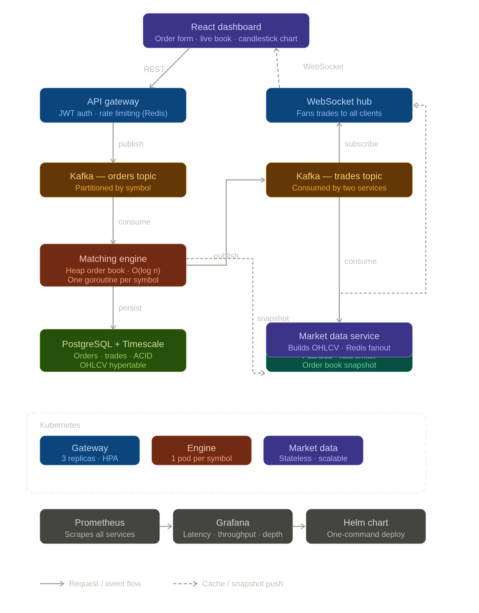

# Order Matching Engine

A production-grade exchange matching engine built in Go — event-driven, containerised, and observable.

Place a buy order. Watch it match a sell in real time. See the trade appear on the dashboard before you blink.

---

## What it does

- Matches buy and sell orders using **price-time priority** (the same algorithm used by real exchanges)
- Processes orders through **Kafka** so every event is durable, replayable, and decoupled
- Maintains a **heap-based order book** — O(log n) matching, not O(n) like a naive hashmap
- Streams live trades to a **React dashboard** over WebSocket via Redis Pub/Sub
- Stores order state in **PostgreSQL** and OHLCV candlestick history in **TimescaleDB**
- Ships as three independent services that scale separately

---

## Architecture



```
React dashboard
      │  REST                         WebSocket
      ▼                                   ▲
 API Gateway ──────► Kafka: orders        │
 (JWT + rate limit)                       │
                          │         Redis Pub/Sub
                          ▼               ▲
                   Matching engine ───────┘
                   (heap order book)
                          │
                 ┌─────────────────┐
                 │                 │
            PostgreSQL       Kafka: trades
            TimescaleDB            │
                                   ▼
                          Market data service
                          (OHLCV candles)
```

---

## Stack

| Layer | Technology | Why |
|---|---|---|
| Backend | Go | Fast, low overhead, excellent concurrency primitives |
| Message broker | Kafka | Durable, replayable, partitioned by symbol |
| Cache / fanout | Redis | Sub-millisecond pub/sub for live trade streaming |
| Primary DB | PostgreSQL | ACID guarantees for order state |
| Time-series | TimescaleDB | Native OHLCV hypertables on top of Postgres |
| API | Gin | Minimal overhead HTTP router |
| Frontend | React + Vite | Fast dev loop, WebSocket-native |
| Containers | Docker + Kubernetes | Full stack deployable with one command |
| Observability | Prometheus + Grafana | Latency, throughput, order book depth |

---

## Run locally

```bash
# Start everything (Kafka, Zookeeper, Postgres, Redis, app services)
docker compose up

# API is at http://localhost:8080
# Dashboard is at http://localhost:3000
# Grafana is at http://localhost:3001
```

**Place an order:**
```bash
curl -X POST http://localhost:8080/orders \
  -H "Authorization: Bearer <token>" \
  -H "Content-Type: application/json" \
  -d '{"symbol":"BTC-USD","side":0,"type":0,"price":42000,"quantity":1.5}'
```

---

## Key design decisions

**The matching engine never touches the database.** It's pure domain logic — order in, trades out. Persistence happens after the fact in a separate step. This is why it's fast and why it's testable.

**One goroutine per symbol.** Matching for BTC-USD never blocks matching for ETH-USD. Each symbol has its own goroutine consuming its own Kafka partition.

**Redis + Kafka together, not either/or.** Kafka gives durability and replay. Redis gives the sub-millisecond fanout that WebSocket clients need. They do different jobs.

---

## Deploy to Kubernetes

```bash
# With Helm (recommended)
helm install ome ./helm/ome --set jwt.secret=your_secret

# Or raw manifests
kubectl apply -f k8s/
```

Cloud: point `values.yaml` at your managed Kafka (MSK / Confluent), Postgres (RDS), and Redis (ElastiCache). App code doesn't change.

---

## Project structure

```
cmd/          three binaries: gateway, engine, marketdata
internal/     implementations: api, engine, kafka, db, cache, service
pkg/          shared domain: models, errors, logger
k8s/          kubernetes manifests
helm/         helm chart
web/          react dashboard
```

---

## Running tests

```bash
go test ./internal/engine/...     # unit tests — no DB needed
go test ./...                     # full suite
```

---

Built as a portfolio project demonstrating event-driven architecture, clean Go service design, and production deployment practices.


## File Structure
```
order-matching-engine/
│
├── cmd/                                  # Service entry points
│   ├── gateway/
│   │   └── main.go                       # API Gateway service
│   ├── engine/
│   │   └── main.go                       # Matching Engine service
│   └── marketdata/
│       └── main.go                       # Market Data Service
│
├── internal/                             # Private packages (not importable externally)
│   ├── api/
│   │   ├── handler.go                    # Gin route handlers
│   │   ├── middleware.go                 # Auth, CORS, logging middleware
│   │   └── ws/
│   │       └── hub.go                    # WebSocket hub & broadcaster
│   │
│   ├── cache/
│   │   ├── redis.go                      # Redis client wrapper (implements Cache port)
│   │   └── util.go                       # Helper functions
│   │
│   ├── config/
│   │   └── config.go                     # Environment config + validation
│   │
│   ├── db/
│   │   ├── postgres.go                   # Database connection setup
│   │   ├── repo.go                       # GORM repositories (implements *Repository ports)
│   │   └── migrations.go                 # SQL migrations (create tables, indexes)
│   │
│   ├── engine/
│   │   ├── orderbook.go                  # Heap-based OrderBook implementation
│   │   ├── matcher.go                    # Matching algorithm (implements Matcher port)
│   │   ├── matcher_test.go               # Unit tests for matcher
│   │   └── util.go                       # Helper functions
│   │
│   ├── kafka/
│   │   ├── producer.go                   # Kafka producer (implements EventPublisher port)
│   │   ├── consumer.go                   # Kafka consumer for orders & trades
│   │   └── topics.go                     # Topic config & schema definitions
│   │
│   ├── ports/
│   │   ├── orderbook.go                  # OrderBook interface
│   │   ├── matcher.go                    # Matcher interface
│   │   ├── repository.go                 # Repository interfaces
│   │   ├── broadcaster.go                # Broadcaster interface
│   │   ├── cache.go                      # Cache interface
│   │   └── eventpublisher.go             # EventPublisher interface
│   │
│   └── service/
│       ├── order.go                      # OrderService (orchestrates everything)
│       ├── user.go                       # UserService (auth)
│       ├── ohlcv.go                      # OHLCVService (candlesticks)
│       └── util.go                       # Helper functions
│
├── pkg/                                  # Public packages (can be imported externally)
│   ├── models/
│   │   ├── order.go                      # Order domain model + enums
│   │   ├── trade.go                      # Trade + OHLCV domain models
│   │   └── user.go                       # User domain model
│   │
│   ├── errors/
│   │   └── errors.go                     # Custom error types + HTTP mapping
│   │
│   └── logger/
│       └── logger.go                     # Structured logging (zap)
│
├── k8s/                                  # Kubernetes manifests
│   ├── gateway-deployment.yaml           # Gateway service deployment
│   ├── gateway-service.yaml              # Gateway LoadBalancer service
│   ├── engine-deployment.yaml            # Engine stateful deployment
│   ├── engine-service.yaml              # Engine headless service
│   ├── marketdata-deployment.yaml        # Market Data deployment
│   ├── configmap.yaml                    # Environment config
│   ├── secret.yaml                       # Secrets (JWT, DB password)
│   ├── pvc.yaml                          # Persistent volume for Kafka/Postgres
│   ├── hpa.yaml                          # Horizontal Pod Autoscaler for gateway
│   └── ingress.yaml                      # Ingress for external traffic
│
├── helm/                                 # Helm chart for distribution
│   └── ome/
│       ├── Chart.yaml                    # Helm chart metadata
│       ├── values.yaml                   # Default chart values
│       └── templates/
│           ├── deployment.yaml
│           ├── service.yaml
│           ├── configmap.yaml
│           └── secret.yaml
│
├── web/                                  # React frontend
│   ├── public/
│   │   └── index.html
│   ├── src/
│   │   ├── App.tsx
│   │   ├── components/
│   │   │   ├── OrderForm.tsx             # Place order form
│   │   │   ├── OrderBook.tsx             # Live order book display
│   │   │   ├── TradeFeed.tsx             # Live trade feed
│   │   │   ├── CandlestickChart.tsx      # OHLCV candlestick chart
│   │   │   └── Navbar.tsx                # Auth + navigation
│   │   ├── services/
│   │   │   ├── api.ts                    # REST API client
│   │   │   └── websocket.ts              # WebSocket connection
│   │   ├── hooks/
│   │   │   ├── useAuth.ts
│   │   │   ├── useOrderBook.ts
│   │   │   └── useTrades.ts
│   │   ├── types/
│   │   │   └── index.ts                  # TypeScript types (mirror pkg/models)
│   │   └── styles/
│   │       └── App.css
│   ├── package.json
│   └── tsconfig.json
│
├── scripts/
│   ├── setup-db.sh                       # Create Postgres tables + TimescaleDB extension
│   ├── setup-kafka.sh                    # Create Kafka topics
│   ├── load-test.sh                      # Basic load testing script
│   └── seed-data.sh                      # Populate sample data
│
├── docker/
│   ├── Dockerfile                        # Multi-stage build for Go services
│   └── docker-compose.yml                # Local dev stack (Kafka, Postgres, Redis, services)
│
├── migrations/                           # SQL migration files (for flyway or similar)
│   ├── 001_create_users.sql
│   ├── 002_create_orders.sql
│   ├── 003_create_trades.sql
│   └── 004_create_ohlcv_hypertable.sql
│
├── .gitignore
├── .env                                  # Local dev environment variables
├── .env.example                          # Template for .env
├── go.mod                                # Go module definition
├── go.sum                                # Go dependencies lock file
├── Makefile                              # Common tasks (build, test, docker, k8s)
│
├── README.md                             # Project overview + setup instructions
├── ARCHITECTURE.md                       # Detailed architecture design document
└── DEPLOYMENT.md                         # Cloud + Kubernetes deployment guide
```
